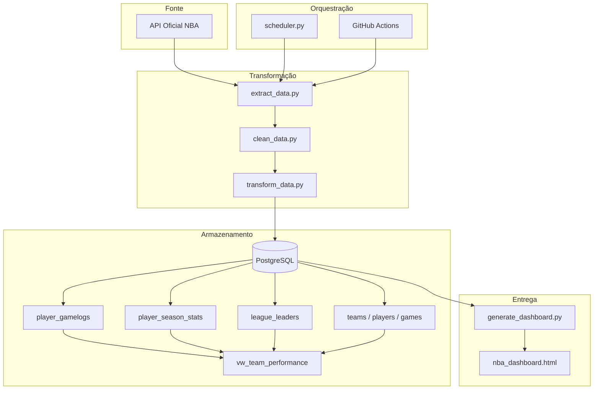

# NBA Performance Monitor — ETL & Dashboard Analítico

## Visão Geral

Este projeto implementa um pipeline ETL completo para coleta automática de estatísticas da NBA via API oficial, cálculo de métricas avançadas de desempenho e geração de um dashboard interativo com dados reais. O pipeline é orquestrado localmente ou via GitHub Actions, rodando diariamente de forma totalmente autônoma.

### Módulos do Pipeline

| Módulo                   | Descrição                                                                                      |
|--------------------------|-----------------------------------------------------------------------------------------------|
| **Extração**             | Coleta game logs, líderes e resultados da API oficial com retry e respeito ao rate limit       |
| **Limpeza**              | Padroniza colunas, converte tipos, remove registros inválidos e deduplica                      |
| **Transformação**        | Calcula Impact Score, True Shooting %, Game Score, Z-score e rolling averages                  |
| **Carga**                | Upsert no PostgreSQL com validação de FKs antes de subir                                       |
| **Dashboard**            | Gera `nba_dashboard.html` interativo com 4 abas diretamente do banco                           |

### Fluxo de Processamento

1. **Extração** (`extract_data.py`) — Busca dados da API da NBA e salva em `dados_brutos/`
2. **Limpeza** (`clean_data.py`) — Normaliza e valida os dados brutos em `dados_processados/`
3. **Transformação** (`transform_data.py`) — Calcula métricas avançadas, outliers e rolling averages
4. **Carga** (`load_database.py`) — Realiza upsert no PostgreSQL com validação de integridade
5. **Dashboard** (`generate_dashboard.py`) — Lê o banco e regera o `nba_dashboard.html`

---

### Dependências

```bash
pip install -r requirements.txt
```

Dependências principais:

- `nba_api` — Fonte de dados oficial da NBA
- `pandas` + `numpy` — Transformação e manipulação de dados
- `scipy` — Cálculo de Z-score e detecção de outliers
- `sqlalchemy` — Conexão com PostgreSQL e upsert
- `apscheduler` — Agendamento local do pipeline
- `psycopg2-binary` — Driver PostgreSQL para Python

**Requisitos de ambiente:**

- Python >= 3.11
- PostgreSQL >= 16

---

## Estrutura do Projeto

```plaintext
.
├── extract_data.py           # Extração da API da NBA com retry e rate limit
├── clean_data.py             # Limpeza, normalização e deduplicação
├── transform_data.py         # Métricas avançadas, Z-score e rolling averages
├── load_database.py          # Upsert no PostgreSQL com validação de FKs
├── generate_dashboard.py     # Geração do dashboard HTML a partir do banco
├── scheduler.py              # Orquestrador local com agendamento diário
├── create_tables.sql         # DDL das 5 tabelas e view (idempotente)
├── analytics_queries.sql     # 10 queries analíticas prontas para uso
├── nba_dashboard.html        # Dashboard interativo — abre direto no navegador
├── daily_pipeline.yml        # GitHub Actions — automação na nuvem
├── .env.example              # Template das variáveis de ambiente
└── .env                      # Variáveis de ambiente (não versionado)
```

---

## Configuração

### Variáveis de Ambiente (`.env`)

```bash
cp .env.example .env
```

```env
DB_HOST=localhost
DB_PORT=5432
DB_NAME=nba_pipeline
DB_USER=postgres
DB_PASSWORD=sua_senha
```

> O `.env` está no `.gitignore` e não é versionado. Para rodar via GitHub Actions, o banco precisa ser acessível pela internet — o projeto utiliza [Neon](https://neon.tech).

---

## Execução

### 1. Criar as tabelas no banco

```bash
psql -U postgres -d nba_pipeline -f create_tables.sql
```

### 2. Rodar o pipeline completo

```bash
python scheduler.py --run-now
```

### 3. Gerar apenas o dashboard (banco já populado)

```bash
python generate_dashboard.py
```

---

## Agendamento

### Local

Mantém o pipeline rodando e dispara automaticamente todo dia às 06:00 ET:

```bash
python scheduler.py
```

Para customizar o horário:

```bash
python scheduler.py --hour 7 --minute 30
```

### Nuvem (GitHub Actions)

O `daily_pipeline.yml` executa o mesmo fluxo sem depender da máquina local. Configure as credenciais em `Settings → Secrets and variables → Actions`:

| Secret            | Descrição                  |
|-------------------|----------------------------|
| `NBA_DB_HOST`     | Host do banco em nuvem     |
| `NBA_DB_PORT`     | `5432`                     |
| `NBA_DB_NAME`     | Nome do banco              |
| `NBA_DB_USER`     | Usuário do banco           |
| `NBA_DB_PASSWORD` | Senha do banco             |

---

## Métricas Calculadas

### Impact Score

Resume o impacto do jogador em um único número ponderado:

```
(PTS×0.35) + (AST×0.20) + (REB×0.20) + (STL×0.12) + (BLK×0.08) − (TOV×0.15)
```

### True Shooting %

Eficiência real de arremesso, considerando lances livres e bolas de três:

```
PTS / (2 × (FGA + 0.44 × FTA))
```

### Game Score (Hollinger)

Nota geral de desempenho por jogo:

```
PTS + 0.4×FGM − 0.7×FGA − 0.4×(FTA−FTM) + 0.7×OREB + 0.3×DREB + STL + 0.7×AST + 0.7×BLK − 0.4×PF − TOV
```

Além disso: **Z-score por jogador** para detectar jogos fora da curva (threshold > 2.5) e **rolling averages** dos últimos 5 e 10 jogos para pontos, assistências, rebotes e Impact Score.

---

## Banco de Dados

### Tabelas

| Tabela                  | Descrição                                               |
|-------------------------|---------------------------------------------------------|
| `teams`                 | Metadata dos times                                      |
| `players`               | Metadata dos jogadores ativos                           |
| `games`                 | Resultado por time e jogo                               |
| `player_gamelogs`       | Box score completo + métricas derivadas por jogo        |
| `player_season_stats`   | Agregados da temporada por jogador                      |
| `league_leaders`        | Snapshot dos líderes por categoria estatística          |

### View

- **`vw_team_performance`** — Win rate, pontuação média e saldo de pontos por time

---

## Dashboard

Gerado pelo `generate_dashboard.py` com dados reais do banco. Abre diretamente no navegador (`nba_dashboard.html`) e contém 4 abas:

| Aba          | Conteúdo                                                                                     |
|--------------|----------------------------------------------------------------------------------------------|
| **Overview** | KPIs gerais, top 50 por Impact Score e classificação por tier (Elite / High Impact / Consistent / Developing) |
| **Players**  | Perfil individual com radar chart e tendência de forma                                        |
| **Teams**    | Ranking por win rate, pontuação média e saldo de pontos                                       |
| **Trends**   | Evolução mensal e distribuição de Impact Score ao longo da temporada                          |

---

## Queries Prontas

`analytics_queries.sql` contém 10 queries para uso imediato no banco ou em qualquer ferramenta de BI:

| # | Query                                                                 |
|---|-----------------------------------------------------------------------|
| 1 | Top 20 por Impact Score (mín. 10 jogos)                               |
| 2 | Evolução de pontos — rolling 5 e 10 dos top 10                        |
| 3 | Home vs. away por time                                                |
| 4 | Jogos fora da curva — Z-score > 2.5                                   |
| 5 | True Shooting Top 30 (mín. 15 jogos)                                  |
| 6 | Ranking de times na temporada                                         |
| 7 | Quadrante consistência vs. produção (Elite / High Impact / Consistent / Developing) |
| 8 | Head-to-head entre dois jogadores                                     |
| 9 | Melhores jogos individuais por Game Score                             |
|10 | Tendência mensal dos top 5                                            |

---

## Diagrama de Arquitetura



---

## Stack

| Tecnologia        | Uso                              |
|-------------------|----------------------------------|
| Python 3.11       | Linguagem principal              |
| nba_api           | Fonte de dados oficial           |
| pandas + numpy    | Transformação de dados           |
| scipy             | Z-score e detecção de outliers   |
| PostgreSQL 16     | Banco de dados                   |
| SQLAlchemy        | Conexão e upsert                 |
| APScheduler       | Agendamento local                |
| GitHub Actions    | Automação na nuvem               |
